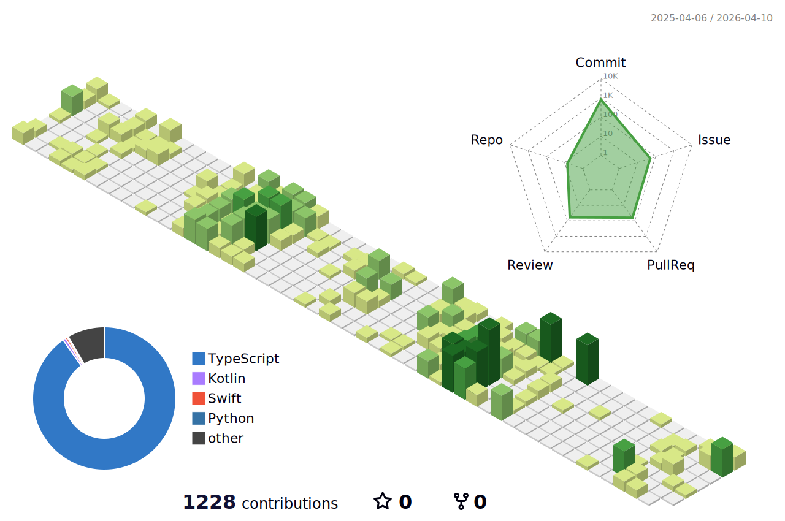

  

 
  
### 🛠 Tech Skill

 

 

 

  

### 🤝 Collaboration Tools

 
 

  

### 💻 Projects
| 프로젝트명 | 설명 | 기간 | 수상 |
|-----------|------|------|------|
| [**INSIGHT BOX**](https://github.com/Leets-Official/BOOKMARK-FE) | 저장한 콘텐츠를 다시 꺼내보는 북마크 플랫폼 | 2025.06 ~ 2025.08 | 대상 |
| [**JobMate.AI**](https://github.com/JobMate-team/jobmate-frontend) | AI 기반 면접 코칭 플랫폼 | 2025.11 ~ 2025.12 | 최우수상 |
| [**SINO**](https://github.com/UMC-SINO/SINO-Front) | 의미있는 신호(SIGNAL)는 남기고, 불필요한 잡음(NOISE)은 줄이자 | 2025.12 | 우수상 |
| [**Nova**](https://github.com/NOVA-9th/nova-fe) | AI 기반 맞춤형 개발자 뉴스 피드 서비스 | 2025.12 ~ 2026.02 | |

  

  
  

<!--

-->

