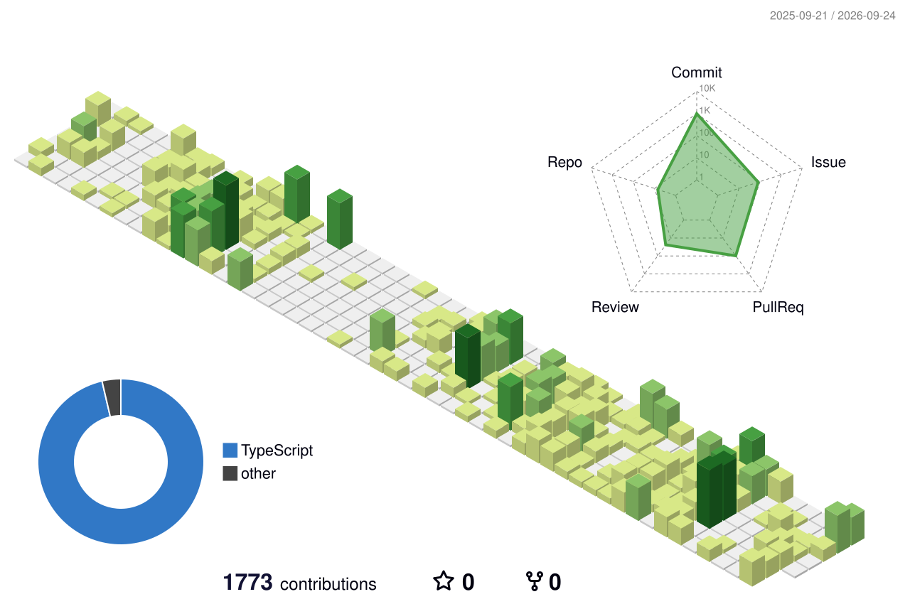

  

<!--

-->

  

  

 

  
  

---

## 🐣 About Me
안녕하세요! 사용자 경험을 중심으로 생각하는 **프론트엔드 개발자 정찬원**입니다. 
**React**와 **Next.js**를 중심으로 웹 서비스를 개발하며, 단순히 보기 좋은 UI를 넘어 **편안하고 자연스러운 인터랙션**을 만드는 것을 좋아합니다.

 

## 🔎 Education & Experiences
>  가천대학교 컴퓨터공학과 **소프트웨어전공** (2021. 03 ~ 재학 중)
>
> Leets 5th **Frontend 시니어** | 25.03 - 25.08
>
> UMC 9th **Web 파트 시니어 챌린저** | 25.09 - 26.02
>
> UMC 10th **Node.js 챌린저** | 26.03 - 26.08
>
> UMC 10th **Web 파트장** | 26.03 - 26.08

 
  
## 🛠 Tech Stacks

### Frontend
 

### Backend
 

### Deployments
 

### Collaboration Tools
 

 

## 💻 Projects
| 프로젝트명 | 설명 | 기간 | 수상 |
|-----------|------|------|------|
| [**INSIGHT BOX**](https://github.com/Leets-Official/BOOKMARK-FE) | 저장한 콘텐츠를 다시 꺼내보는 북마크 플랫폼 | 2025.06 ~ 2025.08 | 대상 |
| [**JobMate.AI**](https://github.com/JobMate-team/jobmate-frontend) | AI 기반 면접 코칭 플랫폼 | 2025.11 ~ 2025.12 | 최우수상 |
| [**SINO**](https://github.com/UMC-SINO/SINO-Front) | 한 해의 경험을 감정 기반으로 정리해주는 회고 서비스 | 2025.12 | 우수상 |
| [**Nova**](https://github.com/NOVA-9th/nova-fe) | AI 기반 맞춤형 개발자 뉴스 피드 서비스 | 2025.12 ~ 2026.02 | |
| [**SafeSign.AI**](https://github.com/SafeSignProject/safeSign-frontend) | AI 기반 계약서 보호 서비스 | 2026.3 ~ 2026.5 | |
| [**IPillGood**](https://github.com/UMC-I-Pill-Good/IPillGood-client) | 나에게 맞는 영양제를 추천하고 관리하는 맞춤형 건강 서비스 | 2026.6 ~ 2026.8 | |

<!--

-->

<!--

-->

---

  

